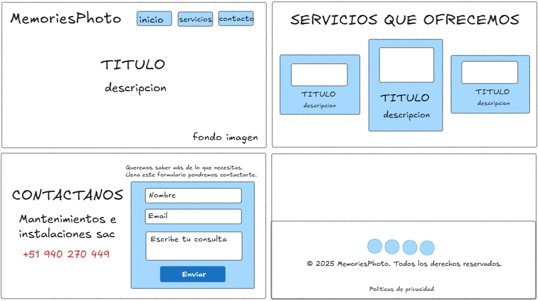
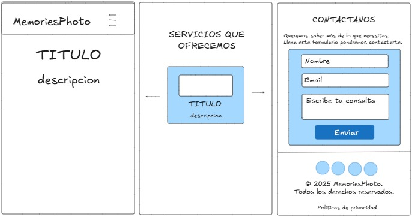

# **Hoja de Requerimientos para Página Web Básica (HTML/CSS)**  
**Objetivo:**  
Desarrollar una página web estática responsiva para evaluar habilidades en HTML y CSS (opcionalmente con Tailwind CSS).  
---  
## **Requerimientos Funcionales**  

| **ID** | **Requisito** | **Checklist** |  
|--------|--------------|---------------|  
| RF-001 | Página con estructura HTML5 válida (DOCTYPE, head, body). | ✓ |  
| RF-002 | Barra de navegación con al menos 3 secciones (Inicio, Servicios, Contacto). | ☐✓ |  
| RF-003 | Sección "Inicio" con un título, imagen y párrafo descriptivo. | ✓ |  
| RF-004 | Sección "Servicios" con al menos 3 tarjetas (cards) que muestren servicios ficticios. | ☐ |  
| RF-005 | Sección "Contacto" con un formulario (nombre, email, mensaje y botón de enviar). | ☐ |  
| RF-006 | Footer con información de copyright y enlaces a redes sociales (simulados). | ☐ |  
---  

## **Requerimientos No Funcionales**  

| **ID** | **Requisito** | **Checklist** |  
|--------|--------------|---------------|  
| RNF-001 | Diseño responsivo (adaptable a móviles, tablets y desktop). | ☐ |  
| RNF-002 | Uso de CSS Flexbox o Grid para el layout. | ☐ |  
| RNF-003 | Estilos coherentes (fuentes, colores, espaciados). | ☐ |  
| RNF-004 | Código bien indentado y comentado (opcional). | ☐ |    
---  
## **Puntos Extra (Opcional)**  

| **ID** | **Requisito** | **Checklist** |  
|--------|--------------|---------------|  
| EX-001 | Desarrollo con Tailwind CSS en lugar de CSS puro. | ✓ |  
| EX-002 | Efectos hover en botones o tarjetas. | ☐ |  
| EX-003 | Animaciones simples (transiciones CSS o Tailwind). | ☐ |  
---  
**Instrucciones:**  
- Los alumnos deben marcar los ítems completados en el checklist.  
- El proyecto debe subirse a un repositorio.  
- deberan realizsr el despliegue en github page
- Se evaluará claridad de código, cumplimiento de requisitos y creatividad en el diseño.  

**¡Buena suerte!** 🚀